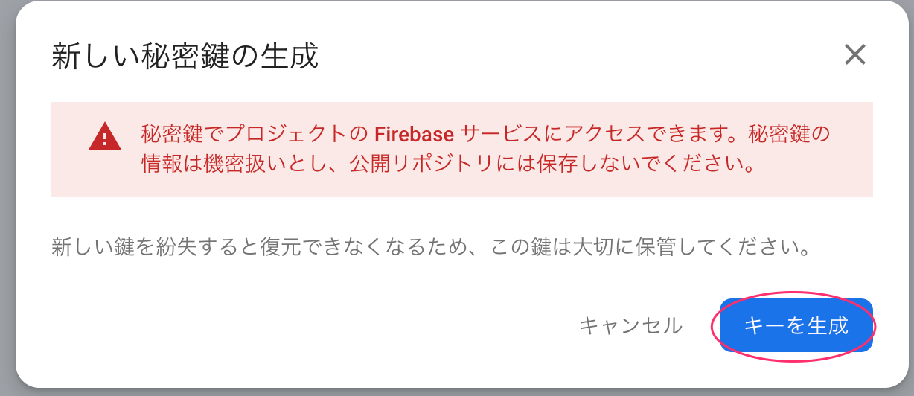

# Treasure ベースアプリ 2024

## これは何

CARTA HOLDINGS のエンジニア向け夏インターン Treasure 2024 で使うベースアプリケーションのリポジトリ

## プロジェクトの開始

VS Codeを起動するには、プロジェクトルートで

```
make
```

を実行します。

`code .`で起動すると設定がうまく読み込まれず、ESLintやPrettierが意図通り動作しません。

## 環境構築

### install Make

#### Mac

- 1. brew のインストール
  - https://brew.sh/ja/
- 2. gcc のインストール
  - brew install gcc
- 3. make のインストール
  - brew install make

`make -v` を実行して以下のような表示が出れば OK

```
GNU Make 3.81
Copyright (C) 2006  Free Software Foundation, Inc.
This is free software; see the source for copying conditions.
There is NO warranty; not even for MERCHANTABILITY or FITNESS FOR A
PARTICULAR PURPOSE.

This program built for i386-apple-darwin11.3.0
```

#### Windows(wsl)

- sudo apt install make

`make -v` を実行して以下のような表示が出れば OK

```
GNU Make 4.3
Built for x86_64-pc-linux-gnu
Copyright (C) 1988-2020 Free Software Foundation, Inc.
License GPLv3+: GNU GPL version 3 or later <http://gnu.org/licenses/gpl.html>
This is free software: you are free to change and redistribute it.
There is NO WARRANTY, to the extent permitted by law.
```

### install Docker

- Docker が動けば何でも良いです
- Docker Desktop
  - Mac
    - https://docs.docker.com/desktop/install/mac-install/
  - Win
    - see: https://docs.docker.jp/desktop/windows/wsl.html#wsl-rerequisites

### Node.js 環境の整備

何らかの方法で Node.js をインストールします。特にこだわりがない場合は nvm を使うといいでしょう。

https://github.com/nvm-sh/nvm

公式にあるとおり install script を使ってインストールしましょう。

Windows を利用している場合は WSL 上で環境を作ります。Microsoft が提供している[Node.js を Linux 用 Windows サブシステム (WSL2) にインストールする](https://learn.microsoft.com/ja-jp/windows/dev-environment/javascript/nodejs-on-wsl)を参考にするのがおすすめです。

インストールする Node.js のバージョンは特別事情がない限りは LTS を使うのがいいでしょう。

```
nvm install --lts
```

でインストールしてシェルを一度閉じて再度開くと node コマンドで REPL が起動すれば準備完了です。

```
$node
Network: use --host to expose
Welcome to Node.js v22.4.1.
```

### Firebase の設定

Treasure では認証に Firebase を利用します。バックエンド、フロントエンドそれぞれに設定が必要です。

各自でベースアプリを動かすには https://console.firebase.google.com/ でプロジェクトを作成した上で、「プロジェクトの設定」から以下を実施してください。

まずはプロジェクトを開いて、「プロジェクトの概要」の横にある歯車アイコンをクリックするとメニューが開きます（ちょっと分かりづらい）。


ここから「プロジェクトの設定」を選択します。

#### バックエンドの設定

Firebase Admin SDK を使うために、サービスアカウントの秘密鍵を生成する必要があります。

1. プロジェクトの設定からサービスアカウントを開き、新しい秘密鍵生成ボタンを押す


3. キーを生成ボタンを押すと、秘密鍵が手元の PC に保存される



4. 保存された秘密鍵を `treasure-app-2023/backend/google_service_account_key.json` にコピーする

```sh
cd /path/to/treasure-app-2024
cp /path/to/ダウンロードした秘密鍵ファイル ./backend/google_service_account_key.json
```

#### フロントエンドの設定

Firebase SDK を使うためにアプリケーションを追加して、その設定情報を取得します。

1. 「全般」の下の方にある「マイアプリ」にウェブアプリを追加する


2. アプリのニックネームを適当に入れて登録する（Firebase Hosting は不要です）

3. `frontend/.env.local` を作成し以下をコピペする

```
VITE_FIREBASE_API_KEY='apiKey を入力'
VITE_FIREBASE_AUTH_DOMAIN='authDomain を入力'
VITE_FIREBASE_PROJECT_ID='projectId を入力'
VITE_FIREBASE_STORAGE_BUCKET='storageBucket を入力'
VITE_FIREBASE_MESSAGING_SENDER_ID='messagingSenderId を入力'
VITE_FIREBASE_APP_ID='appId を入力'
VITE_API_BASE_URL='http://localhost:8000'
```

4. firebaseConfig の情報（モザイク部分）を `frontend/.env.local` の `~を入力`　の箇所に入力する
   - 例：`frontend/.env.example`


#### Google ログインを有効にする

プロジェクトで Firebase Auth を有効にして「Sign-in method」を選択し、「追加のプロバイダ」にある「Google」を有効にしてください。


ログインプロバイダの設定は特に変更する必要はありません。


そのまま「保存」すると Google ログインが有効になります。


### ベースアプリの環境構築

- `make setup/first`
  - db などのコンテナが立ち上がり、各種コードの自動生成などが走ります
- backend
  - `make run/backend`
    - 特にエラーなどがログに出なければこれでバックエンドの環境構築は完了です
- frontend
  - `make run/frontend`
    - http://localhost:5173 にアクセスできれば完了です

## tips

- `make compose/logs` で docker の log が見れます
