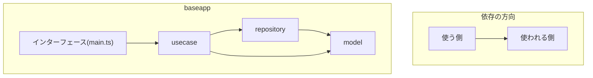

# Backend
treasure2024 baseappのバックエンド

## ざっくりアーキテクチャ


## ファイル構成
```
/backend/
└── src/
   ├── converter/
   │   └── modelとレスポンス用の型を変換する
   ├── database/
   │   └── databaseの設定など
   ├── middleware/
   │   └── req, resの前後に入れたい処理をする(認証, loggerの設定など)
   ├── model/
   │   └── サービスの中心となるオブジェクトを定義
   ├── openapi/
   │   └── OASから自動生成したschema
   ├── repository/
   │   └── 永続化層とのやり取り
   ├── usecase/
   │   └── 利用者の目的を達成する
   ├── errors.ts
   │   └── アプリケーションで使うエラーの定義
   └── main.ts
       └── インターフェース, 利用者とのやり取り
```
